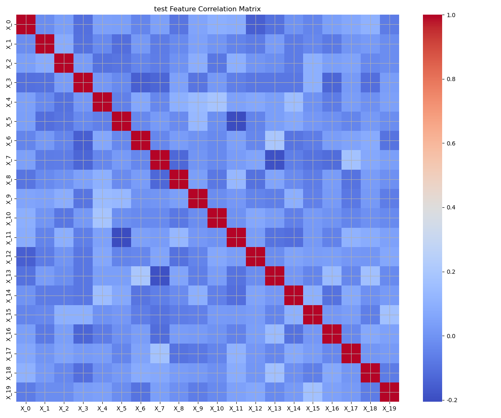
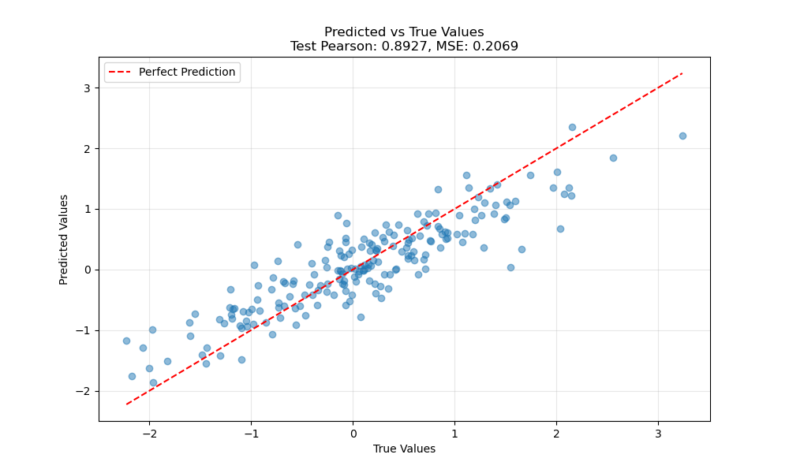
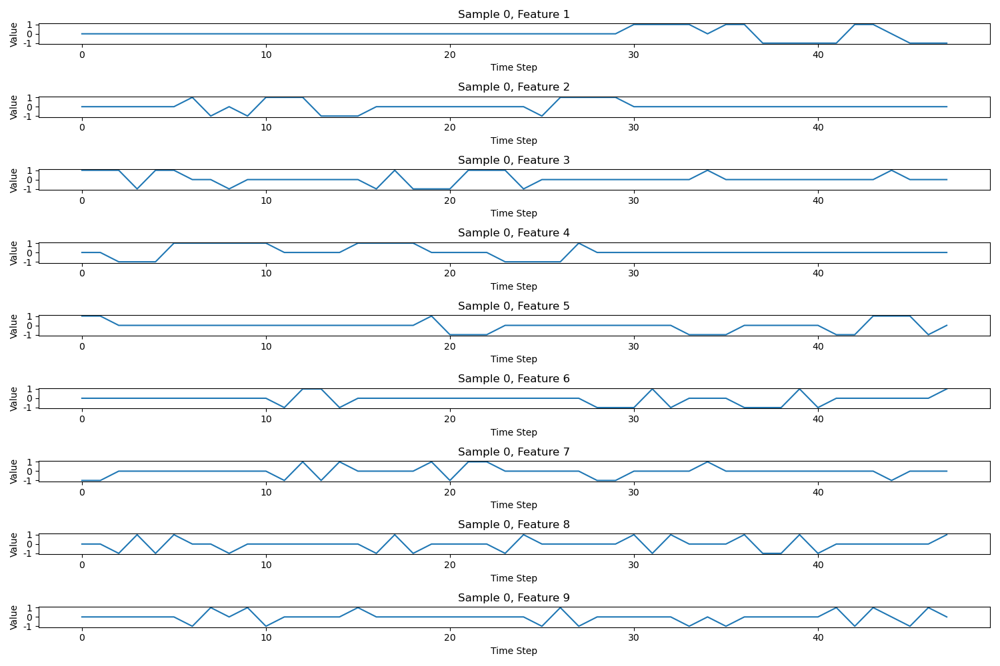
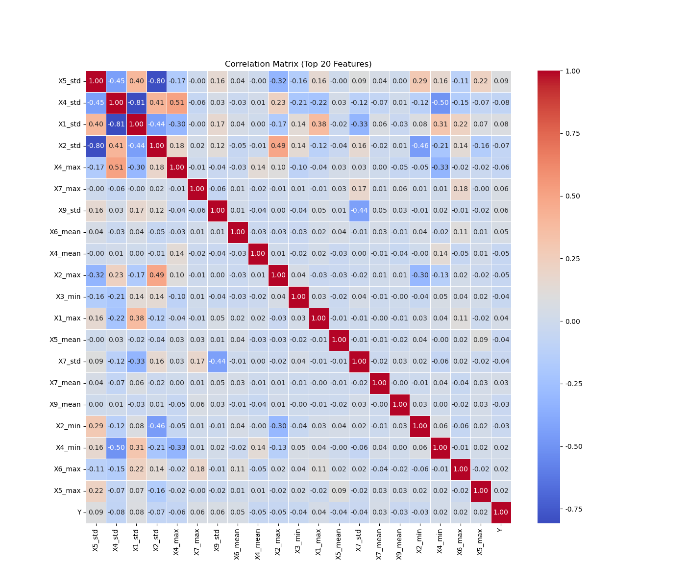
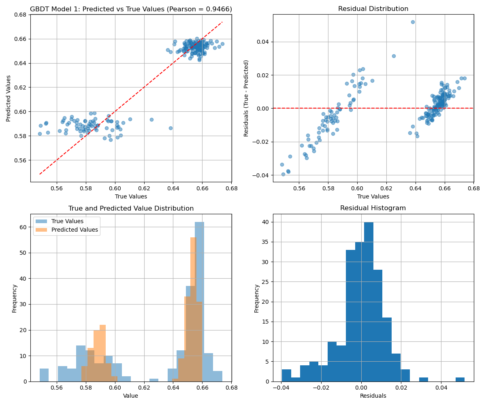
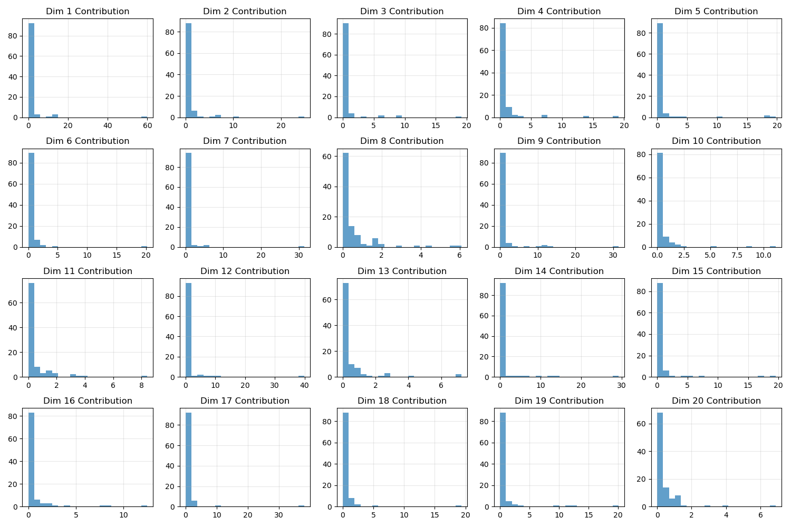
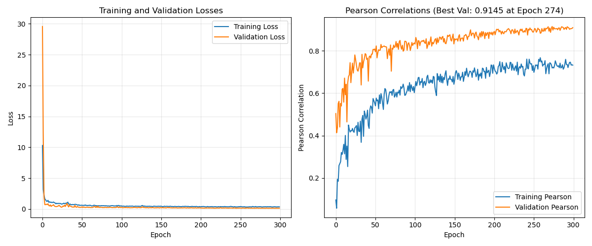
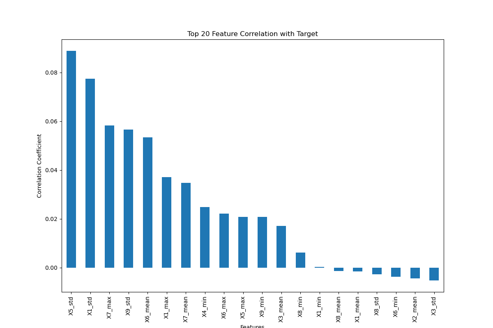

# Week3 机器学习项目集合

本项目包含两个独立的机器学习任务，分别针对20D Schwefel数据集以及unknow48数据集的回归问题，进行了从传统机器学习到深度学习的多种建模方法，目标为尽可能提升pearson ratio。

## 项目概述

### 任务1：Schwefel函数神经网络逼近
- **目标**：使用神经网络逼近20维Schwefel函数
- **数据特点**：1000个20维样本。每个维度独立性强
- **模型方法**：基于函数维度分解的神经网络架构
- **最终结果**：Pearson ratio= 0.892

### 任务2：Unknown48时序数据回归预测
- **目标**：对三维时序数据进行回归预测
- **数据特点**： (1000个训练集样本, 48个时间步, 9个特征) 的时序结构，特征与目标变量的相关性较弱
- **模型方法**：GBDT
- **最终结果**：Pearson ratio= 0.947

## 项目结构

```
week3/
├── schwefel/                       # Schwefel函数逼近任务
│   ├── data/                      # 数据目录
│   ├── models/                    # 模型保存
│   ├── results/                   # 结果输出
│   ├── visualizations/            # 可视化结果
│   ├── decomposed_nn.py          # 分解神经网络
│   ├── auto_decomposed_nn.py     # 自动分解神经网络
│   ├── train_rf.py               # 随机森林训练
│   ├── train_gbdt.py             # 梯度提升树训练
│   ├── data_analysis.py          # 数据分析
│   ├── model_explanation.md      # 模型详细说明
│   ├── requirements.txt          # 依赖列表
│   └── README.md                 # 子任务说明
├── unknown48/                      # Unknown48时序回归任务
│   ├── data/                      # 数据目录
│   ├── models/                    # 模型保存
│   ├── results/                   # 结果输出
│   ├── visualizations/            # 可视化结果
│   ├── cnn_model.py              # 一维CNN模型
│   ├── cnn_model_2d.py           # 二维CNN模型
│   ├── hybrid_model.py           # CNN+LSTM混合模型
│   ├── train_resnet_1d.py        # 一维ResNet
│   ├── train_resnet_2d.py        # 二维ResNet
│   ├── train_gbdt.py             # 梯度提升树
│   ├── train.py                  # 传统ML模型
│   ├── data_analysis.py          # 数据分析
│   ├── 分析报告.md                # 数据分析报告
│   ├── requirements.txt          # 依赖列表
│   └── README.md                 # 子任务说明
├── data_analysis_results/          # 整体数据分析结果
├── visualizations/                 # 全局可视化结果
├── best_model.pth                 # 最佳模型权重
├── best_pearson_model.pth         # 最佳Pearson模型
├── best_val_model.pth             # 最佳验证模型
└── readme.md                      # 主项目说明（本文件）
```

## 技术栈

### 核心框架
- **Python 3.8+**：主要编程语言
- **PyTorch**：深度学习框架
- **Scikit-learn**：传统机器学习
- **NumPy/Pandas**：数据处理
- **Matplotlib/Seaborn**：数据可视化

### 机器学习方法
- **深度学习**：CNN、LSTM、ResNet、混合模型
- **传统ML**：随机森林、梯度提升树、支持向量机
- **集成学习**：投票回归、堆叠回归
- **特征工程**：时序特征、统计特征、函数特征

## 数据分析与训练结果

### Schwefel数据集

#### 数据分析结果
<div align="center">

<p><em>Schwefel数据集维度相关性分析</em></p>
</div>

详细分析结果见：`schwefel/analysis_results/20250320_224945/`

#### 回归性能
<div align="center">

<p><em>Schwefel函数预测结果：预测值 vs 真实值 (Pearson = 0.892)</em></p>
</div>

详细训练结果见：`schwefel/visualizations/auto_decomposed_20250409_213546/`

### Unknown48数据集

#### 数据分析结果
<div align="center">

<p><em>Unknown48数据集时序特征可视化（样本0的9个特征在48个时间步的变化）</em></p>
</div>

<div align="center">

<p><em>Unknown48数据集特征相关性矩阵</em></p>
</div>

详细分析结果见：`unknown48/data_analysis_results/`

#### 回归性能
<div align="center">

<p><em>Unknown48最佳GBDT模型预测结果：预测值 vs 真实值 (Pearson = 0.947)</em></p>
</div>

详细训练结果见：`unknown48/visualizations/20250321_203139/`

## 数据分析部分结果

### Schwefel函数分解神经网络架构

<div align="center">

<p><em>Schwefel函数各维度贡献分析：展示20个维度对最终预测的贡献分布</em></p>
</div>

<div align="center">

<p><em>自动分解神经网络训练过程：损失函数和Pearson相关系数变化</em></p>
</div>

### Unknown48时序数据分析

<div align="center">

<p><em>Unknown48数据集特征与目标变量的相关性分析</em></p>
</div>


## 环境配置

### 1. 基础依赖安装

```bash
# 安装基础科学计算包
pip install numpy>=1.20.0 scipy>=1.7.0 pandas>=1.3.0
pip install scikit-learn>=1.0.0 matplotlib>=3.4.0 joblib>=1.0.0
```

### 2. 深度学习框架

```bash
# PyTorch (推荐)
pip install torch torchvision --index-url https://download.pytorch.org/whl/cu118

# 或CPU版本
pip install torch torchvision
```

### 3. 额外工具包

```bash
# 梯度提升树
pip install xgboost lightgbm catboost

# 可视化增强
pip install seaborn plotly

# 超参数优化
pip install optuna hyperopt
```

## 数据文件说明

### 数据位置
- **Schwefel数据**：位于 `schwefel/data/raw/` 目录
  - `Schwefel_x_train.npy`、`Schwefel_y_train.npy`
  - `Schwefel_x_test.npy`、`Schwefel_y_test.npy`

- **Unknown48数据**：位于 `unknown48/data/raw/` 目录
  - `x_48_train(1).npy`、`y_48_train(1).npy`
  - `x_48_test(1).npy`、`y_48_test(1).npy`

## 快速开始

### Schwefel函数逼近任务

```bash
# 进入schwefel目录
cd schwefel/

# 数据分析
python data_analysis.py

# 训练自动分解神经网络（推荐）
python auto_decomposed_nn.py

# 训练传统方法对比
python train_rf.py
python train_gbdt.py
```

### Unknown48时序回归任务

```bash
# 进入unknown48目录
cd unknown48/

# 数据分析
python data_analysis.py

# 训练深度学习模型
python hybrid_model.py      # CNN+LSTM混合模型（推荐）
python cnn_model.py         # 一维CNN
python train_resnet_1d.py   # 一维ResNet

# 训练传统方法
python train_gbdt.py        # 梯度提升树
python train.py             # 多种传统模型
```

## 实验方法

### 1. Schwefel函数分解方法

**问题背景**：Schwefel函数具有各维度独立的数学特性
**解决方案**：设计分解神经网络，利用参数共享策略
**技术优势**：
- 相较于CNN，大幅减少模型参数量
- 保持高预测精度（Pearson > 0.89）

### 2. 时序数据多维度建模

**问题背景**：Unknown48数据具有复杂的时序依赖关系
**实验方案**：多种机器学习架构的系统性对比，包括：
- 一维/二维CNN
- CNN+LSTM混合模型
- GBDT
**最终结果**：
- **最佳方法**：GBDT
- **测试集Pearson相关系数**：0.947
- **模型特点**：pearson ratio较高，但是从pred vs true图中可看出模型拟合能力并不好


## 可视化分析

项目包含丰富的可视化分析：

### 数据分析可视化
- 特征分布图和箱线图
- 相关性热力图
- 主成分分析图
- 时序模式可视化

### 模型性能可视化
- 训练/验证损失曲线
- Pearson相关系数变化曲线
- 预测值vs真实值散点图
- 残差分析图

### 模型解释可视化
- 特征重要性排序
- 维度贡献分析（Schwefel）
- 注意力权重可视化（深度模型）

## 文档说明

- **`schwefel/README.md`**：Schwefel任务详细说明
- **`schwefel/model_explanation.md`**：分解神经网络技术细节
- **`unknown48/README.md`**：Unknown48任务详细说明
- **`unknown48/分析报告.md`**：时序数据深度分析报告

## 运行环境要求

- **操作系统**：Linux/Windows/macOS
- **Python版本**：3.8+
- **内存要求**：8GB+ (推荐16GB)
- **GPU要求**：可选，CUDA兼容GPU可加速深度学习训练
- **存储空间**：2GB+ (包含数据、模型和结果)

## todo
添加实验过程中其他模型的性能表现
---
